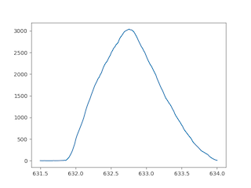

# Spectral measurement

This is the code for performing spectral measurement on my hardware controlled by a raspberry pi zero 2w.

start by running `uv sync` ??

## Run measurements

This will run the spectrsl measurement process:
```
uv run measure_camera
```

## Binaries

1. ### `set_wl`
    ```
    uv run set_wl 632.8
    ```
    rotates the stepper to match the wavelength specified
1. ### `set_filter`
    ```
    uv run set_filter <none|red|violet>
    ```
    sets filter wheel to specified filter
1. ### `set_variable`
    ```
    uv run set_variable <key> <value>
    ```
    set an 'environment variable' (these are persistent and written to disk), they are used to track stepper position between runs and certain parameters. Of course this won't work if the machine is powered off and the monochromator gets adjusted. In that case you will have to recalibrate, using the write_variable binary to do so. The following are the variables (and their defaults):
    - `wl_at_zero_step`: 632800 (632.8 nm * 1000, this is set using a hene laser)
    - `current_step`: whatever the current step is, do not write this unless resetting the calibration - this is updated automatically all the time
    - `revolution_steps`: -3200 (3200 steps for the reference change)
    - `revolution_wl`: 25000 (25.0 nm per rotation)
    - `backlash_steps`: -3000 (-3000 is the default)
    - ~~`last_time`: unix timestamp of last change. maybe? i might add this or not...~~

    To calibrate the machine, use a helium neon laser, and manually set the rotation to its brightest point. Then use `write_variable.py current_step 0` (`wl_at_zero_step` should be set to 632.8nm)
1. ### `measure_camera`
    The main one, runs measurement process from 380-720nm in 2nm steps with dark frame between each. Controls filters and wavelength.
1. ### `cover_light` / `uncover_light`
    Engage/disengage the light cover, used to stop the lamp overheating the monochromator and just to cover/uncover the light for dark frames.
1. ### `measure_sweep`
    ```
    measure_sweep <wl_start> <wl_end> <samples> <sampling_time>
    ```
    Measure a sweep of wavelengths using the photodiode in the integrating spehre. Will save a plot. Can be used to visualise the peak of the HeNe laser, with this command:
    ```
    uv run measure_sweep 631.5 634 160 0.1
    ```
    Producing the following plot:
    
    
